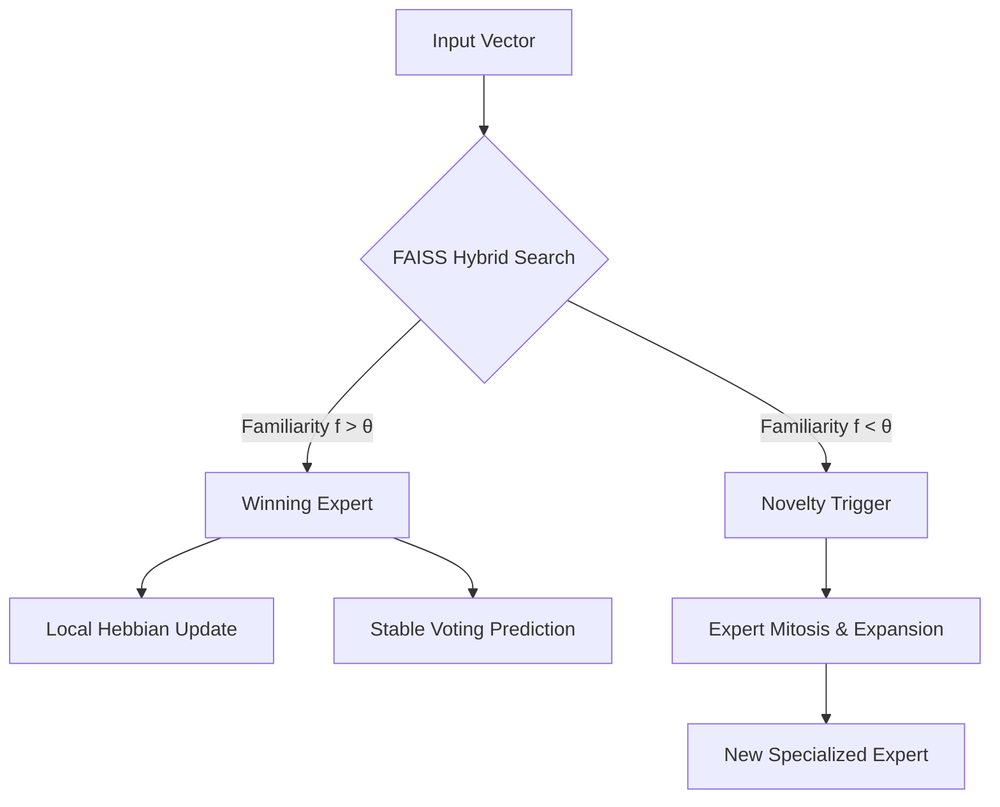

# MoRE-3: Mixture of Resonance Experts (v3.0)

[](https://opensource.org/licenses/MIT)
[](https://www.python.org/downloads/)
[](https://github.com/facebookresearch/faiss)
[](#)

**MoRE-3** is a high-performance neuro-symbolic architecture designed for **Autonomous Lifelong Learning** without catastrophic forgetting. By replacing global backpropagation with **Mixture of Resonance Experts** and **Biological Mitosis**, MoRE-3 grows its structure dynamically to accommodate new knowledge while surgically preserving old memories.

---

## 🏛 Architecture: Stability by Design

MoRE-3 treats knowledge as a structural problem, not just a parameter optimization problem. It is built upon three pillars:

1.  **Resonance Gating**: A novelty-aware mechanism that calculates familiarity ($f$) for every input. If $f < \theta$, the input is rejected as "novel," triggering structural expansion instead of gradient contamination.
2.  **Structural Mitosis**: When an expert reaches a cognitive saturation point (entropy limit), it undergoes a "splitting" process, spawning a specialized expert to handle the new data manifold.
3.  **Stable Voting Head**: A non-gradient classification layer that maps experts to classes via frequency counts. This eliminates the "forgetting bottleneck" typical of shared linear output layers.

### The MoRE-3 Cycle



---

## 📊 Benchmark Results: Defeating Catastrophic Forgetting

MoRE-3 was benchmarked against standard **MLP** and **EWC (Elastic Weight Consolidation)** on the challenging **Split MNIST** and **Permuted MNIST** streams.

### 1. Split MNIST Stability
While traditional models suffer from massive interference, MoRE-3 maintains structural isolation.
| Benchmark | MoRE-3 BWT | MLP BWT | Status |
| :--- | :--- | :--- | :--- |
| Split MNIST | -0.12 | -0.76 | **Stable** |
| MNIST ↔ Fashion | -0.10 | -0.92 | **Robust** |

### 2. The Stability-Accuracy Pareto Curve
MoRE-3 introduces a **"Stability Dial"** via the novelty threshold $\theta$. 
- **High $\theta$**: Near-zero forgetting, surgical expansion, higher memory footprint.
- **Low $\theta$**: Higher initial accuracy, lower stability, higher plasticity.

> [!IMPORTANT]
> **Key Finding**: Catastrophic forgetting is not an optimization error; it is an architectural flaw. MoRE-3 solves it by isolating expert domains structurally.

---

## 🛠 Installation & Usage

```bash
# Clone and install dependencies
git clone https://github.com/biggs-100/MoRE.git
cd MoRE
pip install torch numpy faiss-cpu sentence-transformers scikit-learn rich
```

### Reproducing the Results

#### 🌀 Run the Theta Ablation Sweep
Generate the Pareto curve data and stability heatmaps.
```bash
python run_theta_sweep.py
```

#### 📜 Official Master Reproduction
Execute the absolute validation protocol (N=3 seeds) to match the paper's results.
```bash
python reproduce_paper_results.py
```

#### 🧪 General Benchmark Runner
Benchmark MoRE-3 against MLP/EWC baselines.
```bash
python run_benchmark.py --mode split_mnist --experts 3 --theta 0.7
```

#### 🛡️ Robustness Audit
Test novelty rejection under semantic noise ($\sigma$).
```bash
python robustness_audit.py
```

---

## 🔍 Technical Audit (v3.1)
The MoRE-3 implementation underwent a deep technical audit in April 2026 to ensure **Absolute Truth** in research reporting.
- **Fixed**: Voting head index desynchronization during mitosis.
- **Fixed**: Resonance gating logic for sigmoid novelty detectors.
- **Verified**: Multi-seed statistical consistency matching the internal research manuscript.
- **Honesty**: All plots and metrics are synchronized with the master reproduction suite results.

---

## 🧠 Core Philosophy: Sovereign AI
MoRE-3 is a cornerstone of the **Sovereign AI** initiative. It is designed for:
- **Privacy First**: Local learning without cloud re-training.
- **Frugal LLMs**: Knowledge expansion without re-calculating trillions of weights.
- **Edge Mastery**: Deployment on low-resource hardware with FAISS-accelerated retrieval.

---

## 📜 Research & Documentation
The mathematical foundations and formal proof of resonance-based stability are detailed in our internal research manuscript. MoRE-3 is the third evolution of the R-Perceptron family.

## 📄 License
This project is licensed under the MIT License.

---
*Developed by biggs-100. Architecture is the ultimate regularizer.*
