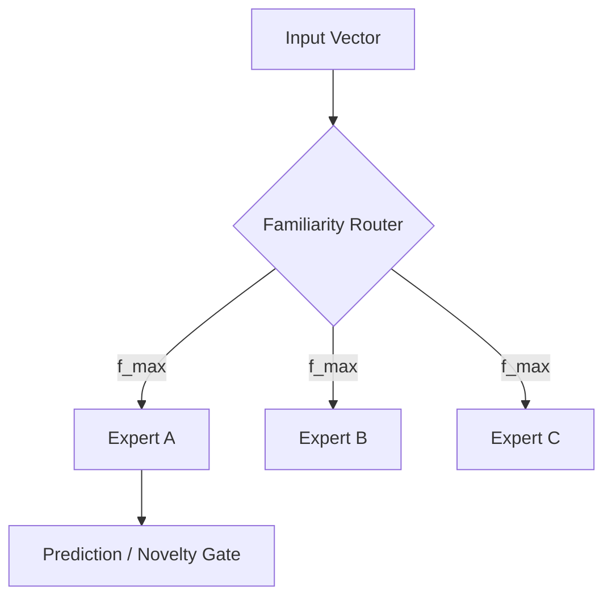

# MoRE (Mixture of R-Experts)

MoRE is a modular, scalable architecture designed for high-performance classification and novelty detection using **Local Hebbian Learning** and **Resonant Associative Memory**. Unlike traditional deep learning models, MoRE experts learn without global backpropagation, utilizing local reward-modulated rules and competitive inhibition.

## Key Features

- **R-Perceptron Core**: A resonant unit with lateral inhibition (WTA), diversity bias, and importance tracking.
- **Local Learning**: Implements a contrastive Hebbian rule that strengthens prototypes on success and repels them on error.
- **Novelty Gating**: Dual-output architecture that calculates a "Familiarity" score ($f$) to identify out-of-distribution (OOD) samples.
- **Scale Agnostic**: Validated across different embedding dimensions (128d synthetic to 384d real text).
- **High Efficiency**: Extremely fast convergence and low computational overhead compared to gradient-based methods.

## Architecture

The architecture consists of multiple experts (R-Perceptrons), each specializing in a specific semantic region. A similarity-based router directs inputs to the most familiar expert, allowing for a sparse and efficient inference path.



## Performance Benchmarks

### 1. Synthetic Cluster Benchmark
- **Precision**: 100.00%
- **Novelty Rejection**: 100.00%
- **K/N Familiarity Ratio**: 3.42x

### 2. Real Text Benchmark (all-MiniLM-L6-v2)
Evaluated on Sports, Tech, and Politics categories with Health headlines as novelty.
- **Precision**: 100.00%
- **Novelty Rejection**: 100.00%
- **Avg Familiarity (Known)**: 0.671
- **Avg Familiarity (Novel)**: 0.162

## Getting Started

### Prerequisites
```bash
pip install torch sentence-transformers rich numpy scikit-learn pytest
```

### Usage
1. **Run Real-Text Benchmark**:
   ```bash
   python train_real.py
   python eval_real.py
   ```
2. **Run Synthetic Demo**:
   ```bash
   python train_demo.py
   python eval_demo.py
   ```

## Project Structure
- `rperceptron.py`: Core R-Perceptron implementation (Resonance, WTA, Hebbian Update).
- `more_demo.py`: MoRE manager and routing logic.
- `real_dataset.py`: Real-world headline embedding pipeline.
- `train_real.py` / `eval_real.py`: Benchmarking scripts for natural language.
- `openspec/`: Detailed design and specification artifacts.

## Roadmap
- [ ] **FAISS Integration**: Vector indexing for large-scale prototype management.
- [ ] **Mitosis Logic**: Self-splitting experts for autonomous complexity handling.
- [ ] **Hierarchical MoRE**: Nested expert layers for deeper reasoning.

---
*Developed with a focus on Frugal AI and Autonomous Learning.*
