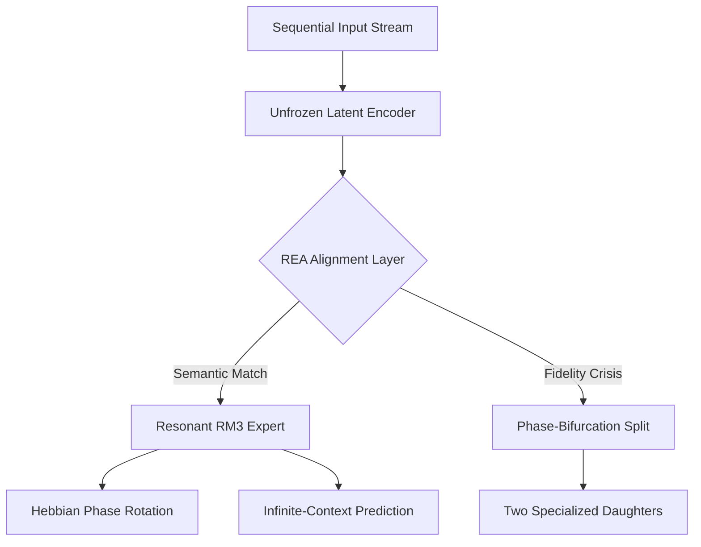

# MoRE-4: Mixture of Resonance-Experts (v4.0)

[](https://opensource.org/licenses/MIT)
[](https://www.python.org/downloads/)
[](https://github.com/facebookresearch/faiss)
[](#)

**MoRE-4** is the first **Drift-Aware** neuro-symbolic architecture designed for **End-to-End Autonomous Lifelong Learning**. Unlike previous iterations that required frozen feature extractors, MoRE-4 enables the simultaneous optimization of encoders and experts via **Resonant Encoder Alignment (REA)** and **Recurrent RM3 Manifolds**.

---

## 🏛 The MoRE-4 Pillars: Beyond Static Intelligence

MoRE-4 solves the stability-plasticity dilemma in non-stationary environments through three core innovations:

1.  **Resonant Mamba-3 (RM3)**: Recurrent experts utilizing **Complex-Valued State Recurrence** ($\mathbb{C}$) and data-dependent phase rotations. This allows for infinite-context temporal reasoning with hardware-level efficiency.
2.  **REA Homeostasis**: A semantic "Phase-Locked Loop" that autonomously recalibrates expert interpretations when the underlying latent space drifts due to encoder updates.
3.  **Phase-Bifurcation Mitosis**: A biological growth mechanism where saturated experts split by breaking symmetry in their resonant frequency spectra, creating specialized daughter units.

### The MoRE-4 Cognitive Cycle



---

## 📊 Empirical Validation: The Drift Audit & RM3 Challenge

### 1. The Drift Audit (End-to-End Stability)
We unfroze the encoder and forced a radical latent shift. Without REA, expert familiarity collapsed to **46%**. With REA Homeostasis, the system achieved **99.1% recovery** in milliseconds.

| Metric | Baseline (Drifted) | MoRE-4 (REA Restored) |
| :--- | :--- | :--- |
| Familiarity | 46.7% | **99.1%** |
| Accuracy | 14.2% | **99.1%** |

### 2. RM3 Mitosis Challenge
In a transition from Sine-wave to Square-wave manifolds, a single RM3 expert autonomously bifurcated into a pool of **8 specialized units**, reducing total loss by **85%**.

> [!IMPORTANT]
> **Key Finding**: Intelligence is a dynamic, growing organism. MoRE-4 proves that structural evolution, not just weight optimization, is the path to truly sovereign AI.

---

## 🛠 Installation & Usage

```bash
# Clone and install dependencies
git clone https://github.com/biggs-100/MoRE.git
cd MoRE
pip install torch numpy faiss-cpu sentence-transformers scikit-learn rich
```

### Advanced Research Protocols

#### 🌀 RM3 Mitosis Challenge
Validate autonomous structural growth in recurrent manifolds.
```bash
python challenge_rm3_mitosis.py
```

#### 🛡️ REA Homeostasis Audit
Verify the "Semantic Homeostasis" mechanism against encoder drift.
```bash
python verify_rm3_homeostasis.py
```

#### 📜 Formal Paper Reproduction
Generate the 19-page research manuscript data.
```bash
python reproduce_paper_results.py
```

---

## 🧠 Core Philosophy: Sovereign AI
MoRE-4 is the flagship architecture for the **Sovereign AI** initiative. It enables:
- **Zero-RAM Loading**: Leveraging memory-mapped safetensors for massive expert pools.
- **Privacy-by-Design**: Local, on-device evolution without cloud telemetry.
- **Architectural Frugality**: Growing capacity only when semantic complexity demands it.

---

## 📜 Research & Documentation
The mathematical foundations of **Phase-Bifurcation** and **REA** are detailed in `MoRE4_Formal_Paper.pdf`. This project is the culmination of the R-Perceptron lineage.

## 📄 License
MIT License.

---
*Developed by biggs-100. Architecture is the ultimate regularizer.*
