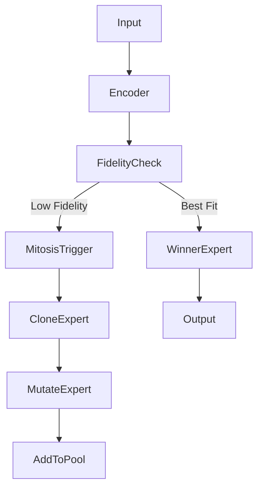

# Technical Design: RM3 Autonomous Mitosis

## Class: `RM3ExpertPool`
This class will manage the collection of `ResonantMamba3Layer` instances.

### Attributes
- `experts`: `nn.ModuleList` of `ResonantMamba3Layer`.
- `projectors`: List of `GradientsProjector` (one per expert).
- `history_fidelity`: Deque of recent max fidelity scores.
- `threshold_mitosis`: Scalar (e.g., 0.4).

### Method: `forward(x, encoder)`
1. Calculate REA fidelity for each expert.
2. Select the winner $E^* = \text{argmax}(Fidelity_i)$.
3. Update `history_fidelity`.
4. If `max(Fidelity) < threshold` for too long, mark for mitosis.
5. Return $E^*(x)$.

### Method: `perform_mitosis(expert_idx)`
1. **Clone**: Create $E_{new} = \text{deepcopy}(experts[expert\_idx])$.
2. **Mutate**:
   ```python
   with torch.no_grad():
       # Shift frequencies to break temporal symmetry
       E_new.A_imag.add_(torch.randn_like(E_new.A_imag) * 0.1)
       # Shift input projections slightly
       E_new.in_proj.weight.add_(torch.randn_like(E_new.in_proj.weight) * 0.01)
   ```
3. **Reset**: Clear $E_{new}$'s `AnchorBuffer`.
4. **Append**: Add $E_{new}$ to `experts`.

## Interaction with `MoRE`
- The `MoRE` class in `more_demo.py` should be refactored to use `RM3ExpertPool` when the `expert_type` is set to 'mamba3'.
- Or, we can create a unified `ResonantExpert` interface that both `RPerceptron` and `RM3` implement.

## Data Flow

